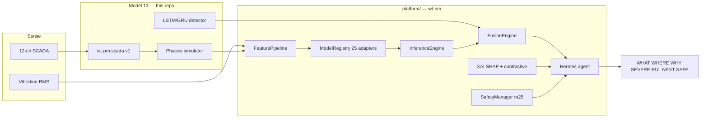

# GitHub architecture — WT-PM

This repository is **two things**, kept separate on purpose:

| Layer | Path | Install | Terminal | What it is |
| --- | --- | --- | --- | --- |
| **Model 13** (reference engine) | `src/wt_pm_lstm/` | `pip install -e .` | `wtpm` | LSTM/GRU SCADA anomaly detector + the shared **schema / registry / eval / drift / HTTP** contract |
| **Unified platform** | `platform/wtpm_platform/` | `pip install -e platform` | `wt-pm` | Orchestrator over **all 25** `wt-pm-*` models: adapters, fusion, Hermes agent, XAI, edge, dashboard |

The 24 sibling repositories stay independent. They are cloned **read-only** into `external/` (gitignored). Adapters import their original `model.py`. Nothing in those repos is patched from here.

```text
github.com/rajaram-2005/
├── wt-pm-lstm-scada-anomaly     ← this repo (model 13 + platform host)
├── wt-pm-1d-cnn-bearing-vibration
├── … 23 other wt-pm-* research repos …
```

```text
wt-pm-lstm-scada-anomaly/
├── src/wt_pm_lstm/          # model 13 package (numpy-only core)
├── tests/                   # 43 tests — must stay green
├── docs/
│   ├── architecture.md      # model 13 internals
│   ├── fidelity_ladder.md
│   └── ecosystem.html       # 25-model fabric (hover graph)
├── platform/                # pip package name: wt-pm
│   ├── wtpm_platform/       # orchestrator, adapters, Hermes, XAI, API
│   ├── tests/               # 30 platform tests
│   └── docs/
│       ├── INSPECTION.md    # audit of all 25 repos (before integration)
│       ├── ARCHITECTURE_REPORT.md
│       ├── MODELS.md        # adapter id, I/O, Hermes/XAI role
│       └── sibling-readmes/ # paste-ready READMEs for the other 24 GitHub repos
├── pyproject.toml           # project: wt-pm-lstm-scada-anomaly  →  wtpm
└── platform/pyproject.toml  # project: wt-pm                     →  wt-pm
```

## Data and control flow



## 25-model engine (adapters, not forks)

Every sibling is one `BaseWTModel` adapter. The router may run all 25 on CLOUD (`connect_all`). MCU deployments still refuse large models.

| Role | Models |
| --- | --- |
| Anomaly (WHAT) | m03 TCN, m04 GRU, m05 LSTM, m06 Informer, m13 SVDD, m14 IForest, m18 PG-BNN, m22 VAE |
| Classification (WHAT/WHERE) | m01 1D-CNN, m07 SNN, m10 RF, m11 XGBoost, m12 SVM |
| Features | m08 SSL, m09 DBN, m23 AeroZip |
| Severity / RUL | m15 HMM, m17 MLP, m02 ConvLSTM, m16 particle filter |
| Twin / fleet / XAI / edge | m19 twin, m20 GNN, m21 SHAP, m24 INT8, m25 TinyML |

Hermes loop (Thought → Action → Observation, observations never invented):

`sensor_quality → anomaly → diagnose → explain → rul → safety → what_if → finish`

XAI: m21 TreeExplainer + healthy-band contrastive z + feature counterfactual + Hermes narrative.

## Commands (copy-paste)

```bash
# model 13 only
pip install -e .
wtpm demo --days 60 --epochs 30
wtpm serve --port 8000
pytest tests -q

# unified platform (25 models)
pip install -e platform
# pip install -e "platform[full]"   # torch, tf, xgboost, shap, …
wt-pm --version
wt-pm inspect
wt-pm fetch-models                 # clone siblings into ./external
wt-pm research --days 12
wt-pm production --days 10 --out production_result.json
wt-pm fleet --turbines 6
wt-pm edge --out edge_artifacts
wt-pm agent --days 8 --quiet       # Hermes trace
wt-pm scada --demo                 # plant SCADA CSV → WTPM.* writeback tags
# historian:  wt-pm scada --in drop\WT07.csv --map tag_map.json --out writeback.json
wt-pm serve --port 8100            # command center
pytest platform/tests -q
```

Until PyPI publish:  
`pip install "git+https://github.com/rajaram-2005/wt-pm-lstm-scada-anomaly.git#subdirectory=platform"`

## What is not claimed

- Sibling repos are architecture stubs (no field weights). Platform trains them per-record on the **rung-1 simulator**.
- Vibration waveforms are **surrogates** (`vibration_is_surrogate=True`).
- RUL targets are **proxies** (time-to-fault-onset).
- m02, m06, m08 are **partial** upstream; m24’s full MobileNet path is out of scope (no image data).
- This session cannot push descriptions onto the other 24 GitHub repos (no write token). Paste from `platform/docs/sibling-readmes/`.

## Documents

| File | Audience |
| --- | --- |
| [README.md](README.md) | model 13 quick start |
| [docs/architecture.md](docs/architecture.md) | model 13 internals |
| [docs/fidelity_ladder.md](docs/fidelity_ladder.md) | what a metric may claim |
| [docs/ecosystem.html](docs/ecosystem.html) | 25-model fabric |
| [platform/docs/INSPECTION.md](platform/docs/INSPECTION.md) | pre-integration audit |
| [platform/docs/ARCHITECTURE_REPORT.md](platform/docs/ARCHITECTURE_REPORT.md) | repo → adapter → I/O → status |
| [platform/docs/MODELS.md](platform/docs/MODELS.md) | one row per model |
